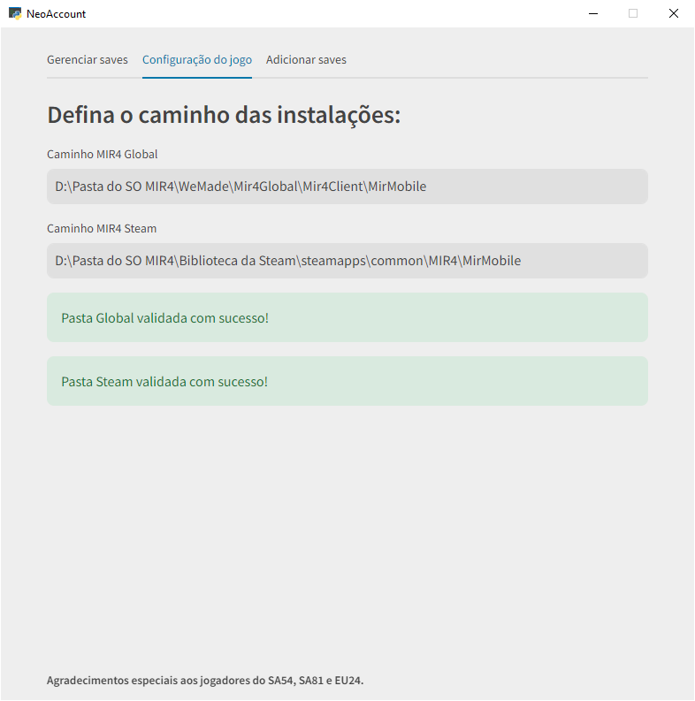

# NeoAccountSwitcher

Utilitário desenvolvido para facilitar a troca entre contas em um MMORPG.  Permite alternar entre várias contas no servidor de boosting, sem a necessidade de reinserção de e-mails.

## Funcionalidades

- **Alternância de Contas**: Permite alternar entre diferentes contas no jogo.
- **Interface Gráfica**: Através do uso do Streamlit, o NeoAccountSwitcher possui uma interface simples para interagir com o programa;
- **Exclusão de Logs e Pastas de Crashes**: O programa facilita a exclusão de arquivos temporários, logs de erro gerados pelo jogo, diminuindo o espaço ocupado.

## Screenshot:



## Como Usar

### 1. Clone o Repositório:

```bash
git clone https://github.com/usuario/NeoAccountSwitcher.git
cd NeoAccountSwitcher
```

### 2. Crie um ambiente virtual, ative-o e instale os requisitos:
````bash
python -m venv .venv
.venv\Scripts\activate.bat
pip install -r requirements.txt
````

### 3. Rodando

Para rodar o programa, você tem duas opções:

1. <b>Abrir o arquivo .bat para ativar o ambiente virtual e executar o programa.</b>


2. <b>Empacotar o programa como um .exe para rodar sem a necessidade do Python, usando ``pyinstaller launcher.spec --clean``<br/> O arquivo .exe será gerado na pasta ``dist``. Só copiar a launcher para qualquer lugar e abrir o .exe</b>